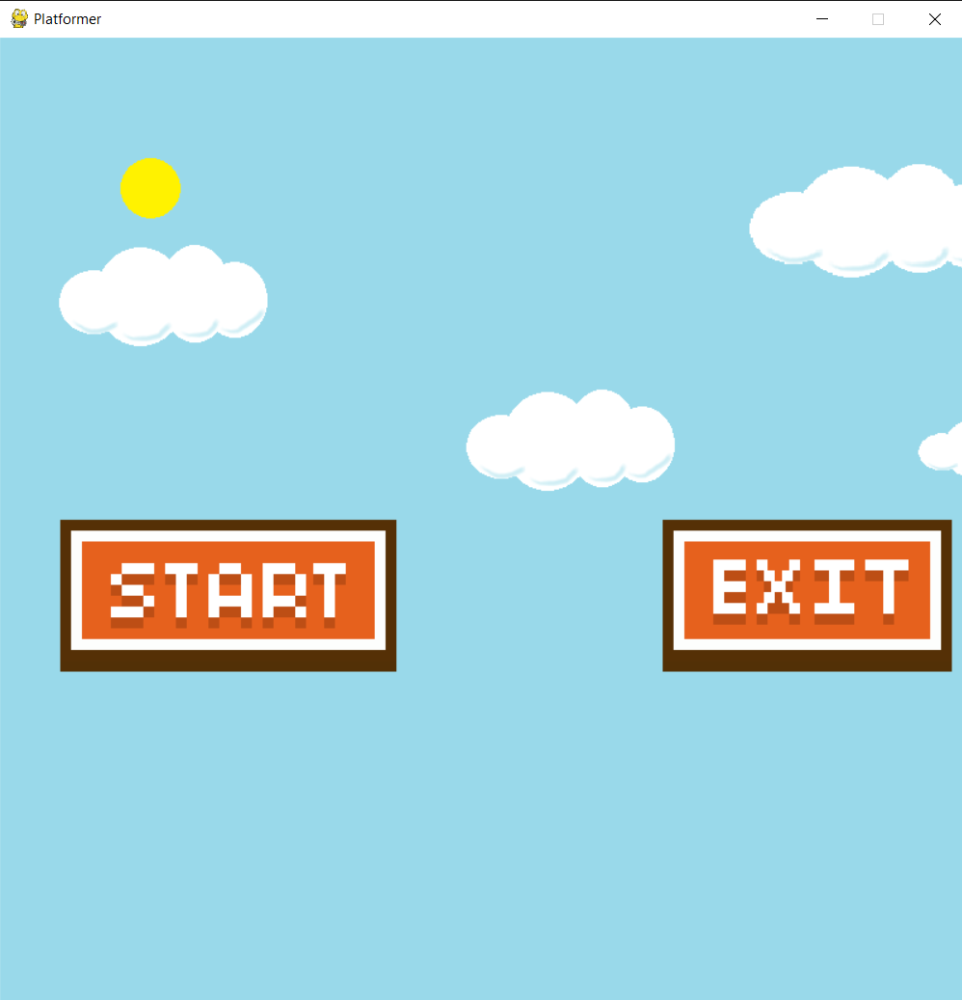
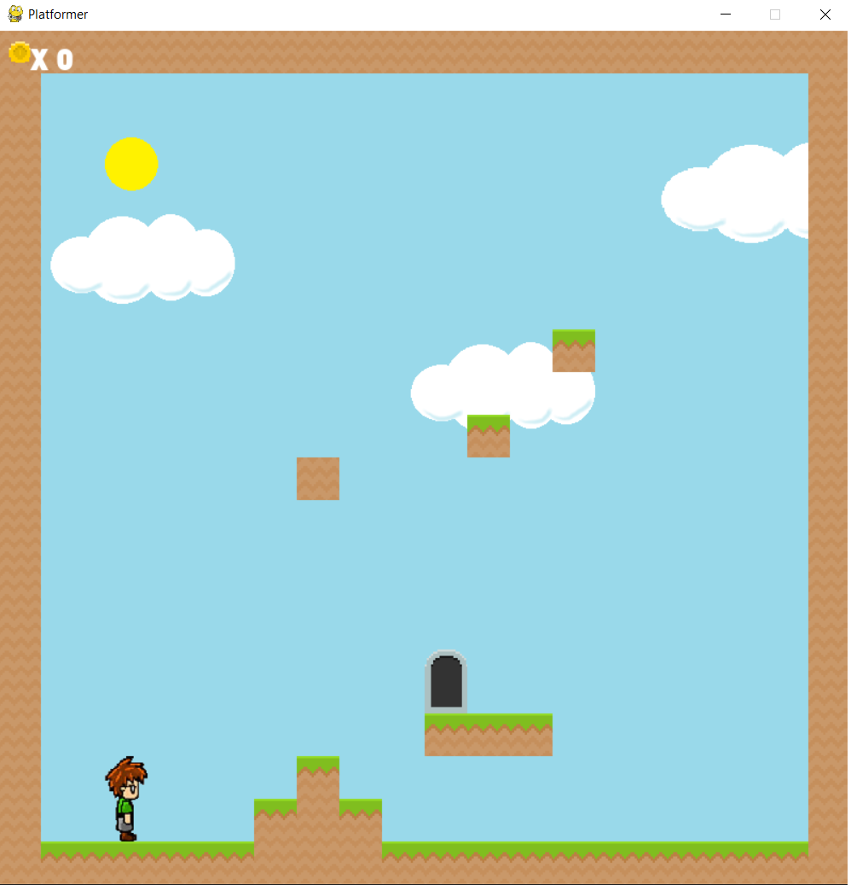
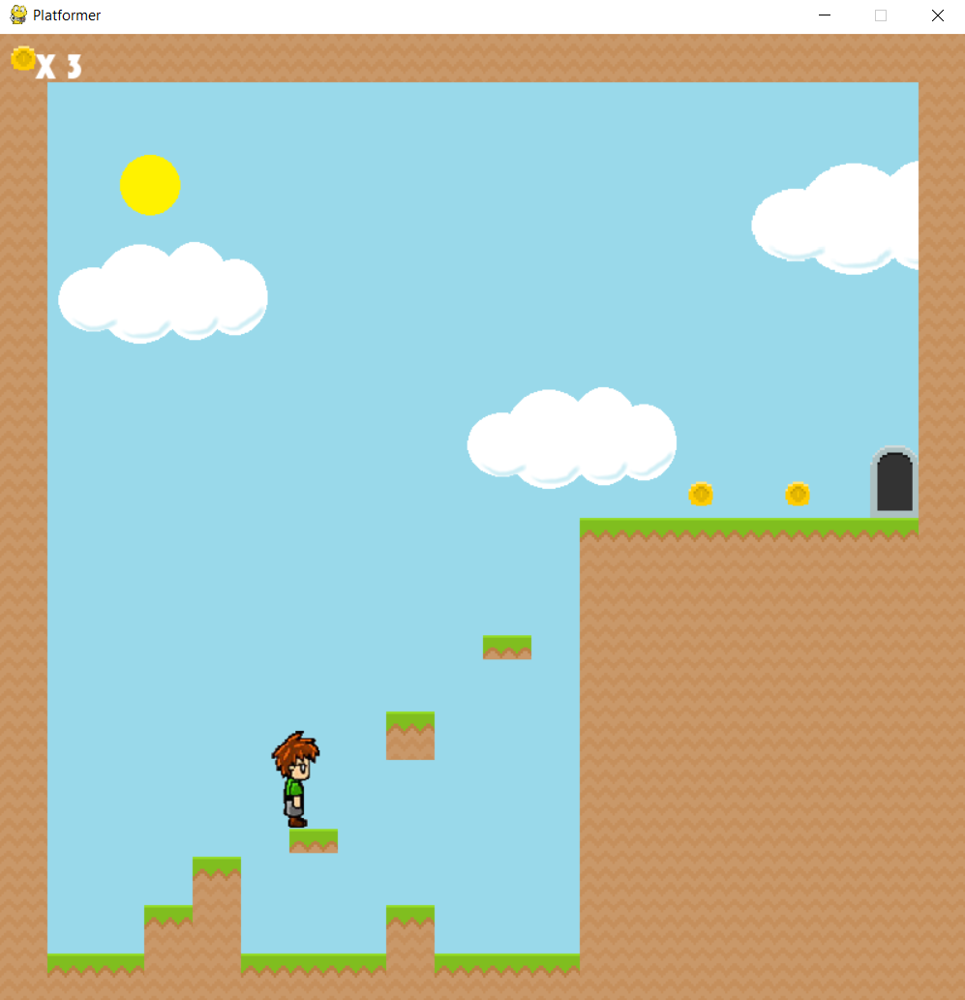
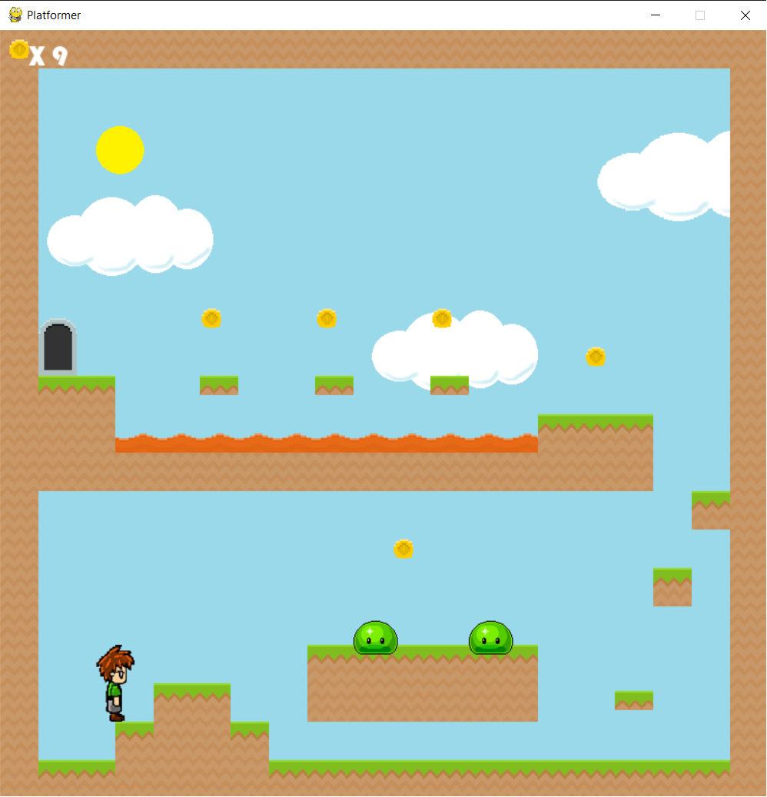
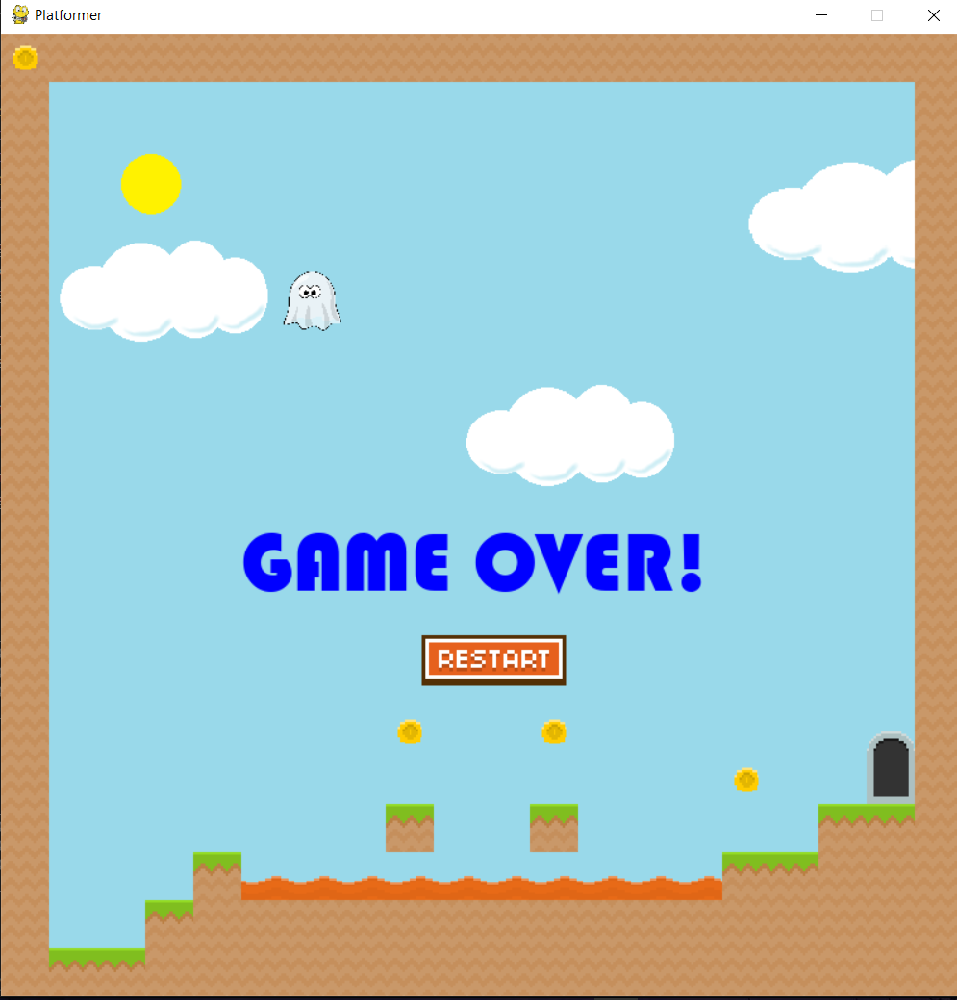

# platformer
* в ветке [one](https://github.com/makarova1507ana/platformer/tree/one) находиться общий вариант в одной файле
* в ветке [many](https://github.com/makarova1507ana/platformer/tree/many) находиться вараинт разбитый по файлам

<h1 align="center">Sky Jump</h1>
<div align="center">
  <h2>2D платформер, созданный с использованием концепций компьютерной графики и визуализации на Python.</h2>
</div>


<div>

### **Скриншоты проекта :**

  
  
  
  


### **Чтобы запустить проект :**

Клонируйте проект -

```
  git clone https://github.com/thecoderenroute/pygame-2d-platformer.git
```

Установите все зависимости -

```
 pip install -r requirements.txt
```

Запустите проект, перейдите в каталог проекта в терминале;

### Запустите скрипт -

для Linux/Mac:

```
  python game.py
```

для Windows:

```
  python game.py
```

#### **Область применения:**

- Поможет понять базовые и продвинутые концепции компьютерной графики и дизайна игр
- Можно легко добавлять любое количество уровней
- Отлично подходит для проведения времени

#### **Планируемые улучшения :**

- Улучшенный ИИ для врагов
- Разработка ИИ для автоматического создания уровней
- Большие уровни с панорамированием камеры
- Добавление наград и прогрессии


